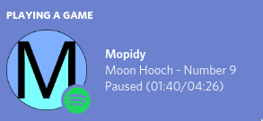

# mopidy-discord-rpc
Discord RPC for Mopidy.

## Screenshots

## Roadmap/Features
- [x] Handle Track & Artist Names
- [x] Custom icon
- [x] Timer synchronizes with play/pause events 
- [x] Get current state from RPC on startup
- [x] Spotify icon for playback from `mopidy-spotify`
- [x] Handle fast-forward/rewind events
- [x] Handle tracks ending (doesn't work sometimes, don't know why)