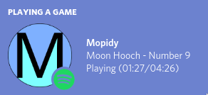

# mopidy-discord-rpc
Discord RPC for Mopidy.

## Screenshots

## Installation

### Downloading the Latest Release
1. Download the [latest release build](https://github.com/very-amused/mopidy-discord-rpc/releases/latest) (no dependencies or runtime needed)

### Building From Source
Build-time dependencies: `go`, `libdiscordprc`
1. Download the source code from the [latest release](https://github.com/very-amused/mopidy-discord-rpc/releases/latest) or pull directly from the main branch (note that non-release source code comes with no guarantees of stability or functionality).
2. Run `go build` or `go install` to build the source code.

### Usage
1. It would be smart to place `mopidy-discord-rpc` somewhere in your PATH for easy access.
2. Make sure both Discord and Mopidy are running, then run `mopidy-discord-rpc` and listen to some music. If a song is already playing or paused, the RPC is smart enough to immediately fetch that info from Mopidy, and write it to your status.

## Roadmap/Features
- [x] Handle Track & Artist Names
- [x] Custom icon
- [x] Timer synchronizes with play/pause events 
- [x] Get current state from RPC on startup
- [x] Spotify icon for playback from `mopidy-spotify`
- [x] Handle fast-forward/rewind events
- [x] Handle tracks ending (doesn't work sometimes, don't know why)
